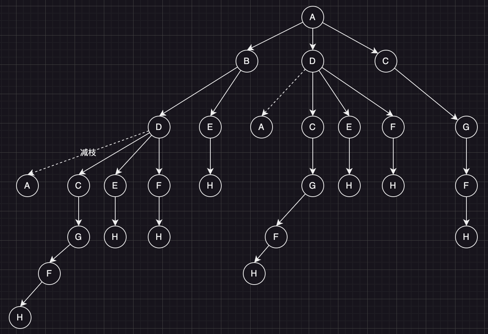

# 可视化有权有向图

执行 `node.py` 脚本，可以可视化有权有向图。
```
python3 node.py
```


# 目标
A为起点，H为终点，找出所有能够从A走到H的路线，每个节点只能通过一次。

## 按照有权有向图创建从A开始的搜索树



从这个树可以看出，从A到H有：
- A-B-D-C-G-F-H
- A-B-D-E-H
- A-B-D-F-H
- A-B-E-H
- A-D-C-G-F-H
- A-D-E-H
- A-D-F-H
- A-C-G-F-H