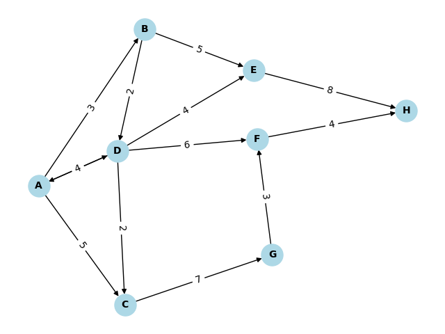

# 迪克斯特拉

## 手推Dijkstra过程

假设起点是A,终点是H,找出最短路径.

- vertex      顶点（节点名称）

- distance    从起点A走到当前节点的最小距离

- pre_vertex  从哪个顶点走到当前顶点

- kwon        表示顶点是否已经被放到最短路径中，0表示没有，1表示有

### 0 初始状态
初始状态，起点A的 distance 是0，表示从A走到A最短距离是0

| vertex | distance | pre_vertex | kwon |
|----|----|----|----|
| A  | 0         | None | 1 |
| B  | $+\infty$ | None | 0 |
| C  | $+\infty$ | None | 0 |
| D  | $+\infty$ | None | 0 |
| E  | $+\infty$ | None | 0 |
| F  | $+\infty$ | None | 0 |
| G  | $+\infty$ | None | 0 |
| H  | $+\infty$ | None | 0 |

### 1 处理A相邻的节点，比较获知走到B节点距离最近

A 相邻节点有 B C D

1. 如果 distance from A to B < 从其他节点走到B的距离，更新B的distance。
2. 同样的对 C，D 的distance 进行更新。

对于初始状态来说：
- 从 A 到 B 的距离是 正无穷，满足条件1，更新成 3
- 从 A 到 C 的距离是 正无穷，满足条件1，更新成 5
- 从 A 到 D 的距离是 正无穷，满足条件1，更新成 4

顶点 B C D中 B 的距离最小，所以将 B 标记成已经在路径节点中，且走到是从A走到B的

**目前路径中的节点有 [A, B]**

| vertex | distance | pre_vertex | kwon |
|----|----|----|----|
| A  | 0         | None | 1 |
| B  | 3         | A    | 0 |
| C  | 5         | A    | 0 |
| D  | 4         | A    | 0 |
| E  | $+\infty$ | None | 0 |
| F  | $+\infty$ | None | 0 |
| G  | $+\infty$ | None | 0 |
| H  | $+\infty$ | None | 0 |

### 2 取节点 B，处理和B相邻的节点

B 相邻的节点有D 和 E。

- 如果走节点 D

    如果是走节点 D，路径是 A-B-D， 累积的 distance = 3 + 2 = 5;
    观察 D 节点 distance 是 4，走 A-B-D的距离 5 要大于从A-D 的距离 4，此时不更新 D 的distance

- 如果走节点 E
    
    如果走节点 E，路径是 A-B-E，累积的 distance = 3 + 5 = 8;
    观察 E 节点 distance 是无穷大，走 A-B-E 的距离 8 要小于 无穷大，此时更新 E 的distance 成 8

| vertex | distance | pre_vertex | kwon |
|----|----|----|----|
| A  | 0         | None | 1 |
| B  | 3         | A    | 1 |
| C  | 5         | A    | 0 |
| D  | 4         | A    | 0 |
| E  | 8         | B    | 0 |
| F  | $+\infty$ | None | 0 |
| G  | $+\infty$ | None | 0 |
| H  | $+\infty$ | None | 0 |

### 3 取 C D E 中distance 最小是 D，处理和D相邻的节点

D 相邻的节点是 A C E F，因为 A 已经处理过了，kwon 被标记成了1，所以 A 不在进行重复处理

- 如果走到节点 C

    D 到 C，路径是 A-D-C，累积的 distance = 4 + 2 = 6
    观察 C 节点的 distance 是 5，此时不更新 C 的 distance

- 如果走到节点 E

    D 到 E，路径是 A-D-E，累积的 distance = 4 + 4 = 8
    观察 E 节点 distance 是 8，此时也不更新 E 的distance

- 如果走到节点 F

    D 到 F，路径是 A-D-F，累积的 distance = 4 + 6 = 10
    观察 F 节点 distance 是正无穷，更新成10

将 D 标记成已经处理过了

| vertex | distance | pre_vertex | kwon |
|----|----|----|----|
| A  | 0         | None | 1 |
| B  | 3         | A    | 1 |
| C  | 5         | A    | 0 |
| D  | 4         | A    | 1 |
| E  | 8         | B    | 0 |
| F  | 10        | D    | 0 |
| G  | $+\infty$ | None | 0 |
| H  | $+\infty$ | None | 0 |

### 4 取 C E F 中 distance 最小的 C，处理和 C 相邻的节点

和 C 相邻的节点有 G

- 走到节点 G

    C 到 G，到C的距离是5，走到 G 累积的 distance = 5 + 7 = 12
    观察 G 节点 distance 是正无穷，更新成 12

把 C 标记成已经处理过

| vertex | distance | pre_vertex | kwon |
|----|----|----|----|
| A  | 0         | None | 1 |
| B  | 3         | A    | 1 |
| C  | 5         | A    | 1 |
| D  | 4         | A    | 1 |
| E  | 8         | B    | 0 |
| F  | 10        | D    | 0 |
| G  | 12        | C    | 0 |
| H  | $+\infty$ | None | 0 |

### 5 取 E F G 中目前 distance 最小的 E，处理和E 相邻的节点

和 E 相邻的节点是 H

- 走到节点 H

    E 到 H， 目前 E 的距离是 8，走到 H 累积的 distance = 8 + 8 = 16
    观察 H 节点 distance 是正无穷，更新成 16

把 E 标记成已经处理过了

| vertex | distance | pre_vertex | kwon |
|----|----|----|----|
| A  | 0         | None | 1 |
| B  | 3         | A    | 1 |
| C  | 5         | A    | 1 |
| D  | 4         | A    | 1 |
| E  | 8         | B    | 1 |
| F  | 10        | D    | 0 |
| G  | 12        | C    | 0 |
| H  | 16        | E    | 0 |

### 6 取 F G 中 distance 最小的 F，处理和F 相邻的节点

和 F 相邻的节点是 H

- 走到节点 H

    F 到 H，目前 F 的距离是 10，走到 H 累积的 distance = 10 + 4 = 14
    观察 H 节点 distance 是 16，更新成 14

把 F 标记成已经处理过

| vertex | distance | pre_vertex | kwon |
|----|----|----|----|
| A  | 0         | None | 1 |
| B  | 3         | A    | 1 |
| C  | 5         | A    | 1 |
| D  | 4         | A    | 1 |
| E  | 8         | B    | 1 |
| F  | 10        | D    | 1 |
| G  | 12        | C    | 0 |
| H  | 14        | F    | 0 |

### 7 取 G 相邻的节点，发现相邻的 F已经被处理过，此时结束

| vertex | distance | pre_vertex | kwon |
|----|----|----|----|
| A  | 0         | None | 1 |
| B  | 3         | A    | 1 |
| C  | 5         | A    | 1 |
| D  | 4         | A    | 1 |
| E  | 8         | B    | 1 |
| F  | 10        | D    | 1 |
| G  | 12        | C    | 1 |
| H  | 14        | F    | 0 |

### 从 H 开始，反向的找出这个路径

H F D A  反一下就成了  A -> D -> F - H